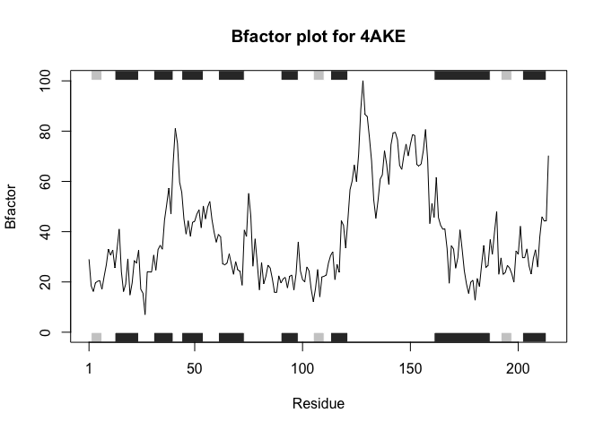
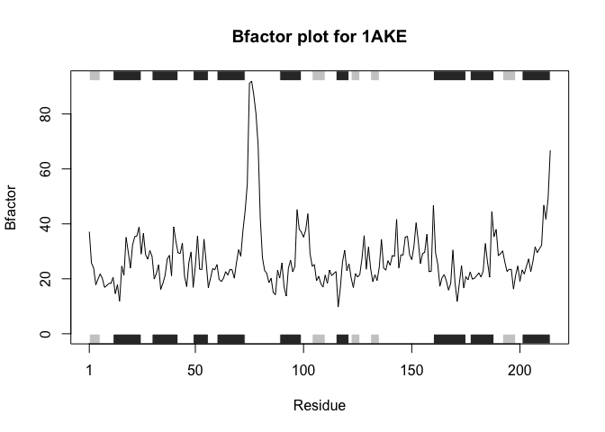

# HW Class 6
Zixuan Zeng(A16142927)

\##Original code:

``` r
library(bio3d) 
s1 <- read.pdb("4AKE")  # kinase with drug 
```

      Note: Accessing on-line PDB file

``` r
s2 <- read.pdb("1AKE")  # kinase no drug 
```

      Note: Accessing on-line PDB file
       PDB has ALT records, taking A only, rm.alt=TRUE

``` r
s3 <- read.pdb("1E4Y")  # kinase with drug 
```

      Note: Accessing on-line PDB file

``` r
s1.chainA <- trim.pdb(s1, chain="A", elety="CA") 
s2.chainA <- trim.pdb(s2, chain="A", elety="CA") 
s3.chainA <- trim.pdb(s1, chain="A", elety="CA") 
s1.b <- s1.chainA$atom$b 
s2.b <- s2.chainA$atom$b 
s3.b <- s3.chainA$atom$b 
plotb3(s1.b, sse=s1.chainA, typ="l", ylab="Bfactor") 
```


``` r
plotb3(s2.b, sse=s2.chainA, typ="l", ylab="Bfactor") 
```


``` r
plotb3(s3.b, sse=s3.chainA, typ="l", ylab="Bfactor")
```


\##Improved code:

``` r
library(bio3d)
plotb3factor <- function(protein_id){
  for (id in protein_id){
    protein <- read.pdb(id)
    chainA <- trim.pdb(protein, chain="A", elety="CA")
    bfactor <- chainA$atom$b
    plotb3(bfactor,sse=chainA,typ="l", ylab="Bfactor", main=paste("Bfactor plot for", id))
  }
}
#Test
plotb3factor(c("4AKE", "1AKE", "1E4Y"))
```

      Note: Accessing on-line PDB file

    Warning in get.pdb(file, path = tempdir(), verbose = FALSE):
    /var/folders/hf/y1pqvvwd0v11pdxh10fw5hy80000gn/T//RtmpW4Ibpx/4AKE.pdb exists.
    Skipping download



      Note: Accessing on-line PDB file

    Warning in get.pdb(file, path = tempdir(), verbose = FALSE):
    /var/folders/hf/y1pqvvwd0v11pdxh10fw5hy80000gn/T//RtmpW4Ibpx/1AKE.pdb exists.
    Skipping download

       PDB has ALT records, taking A only, rm.alt=TRUE



      Note: Accessing on-line PDB file

    Warning in get.pdb(file, path = tempdir(), verbose = FALSE):
    /var/folders/hf/y1pqvvwd0v11pdxh10fw5hy80000gn/T//RtmpW4Ibpx/1E4Y.pdb exists.
    Skipping download


\##Documentation question The inputs are protein information obtained
from PDB. The function takes in the protein and trim it to leave only
chain A. The element type is set to the alpha carbon atom. Then, the
function extracts column B information from chain A atoms, and names as
bfactor. The function next uses chain A as the secondary structure
element to construct a line plot. The label on the y axis is set to
Bfactor and on the top the function prints Bfactor plot for a given PDB
id. The output is a line graph entailing the Bfactor information of each
residue of chain A of a given PDB id.
