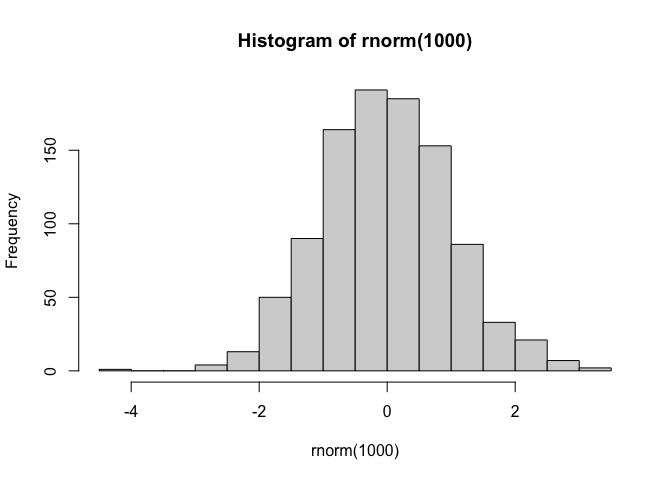
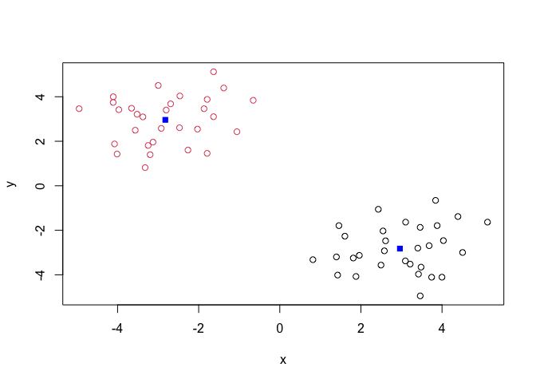
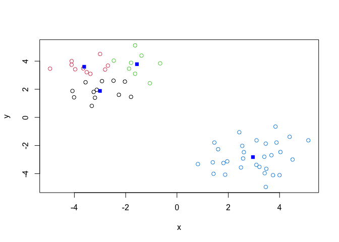
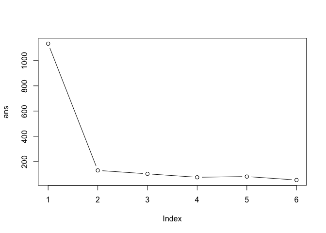
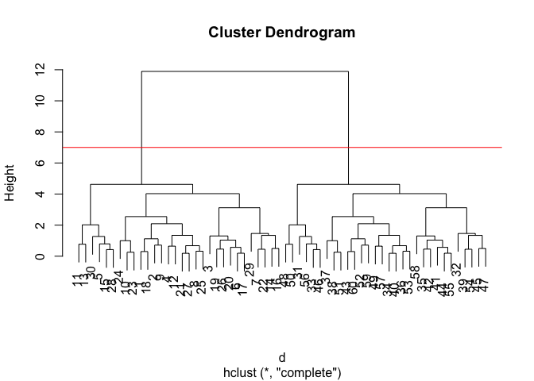
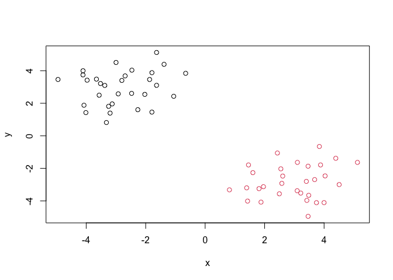
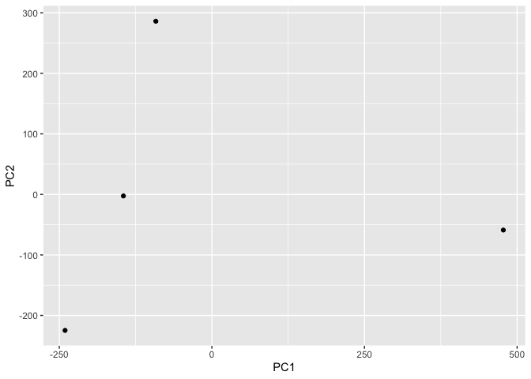
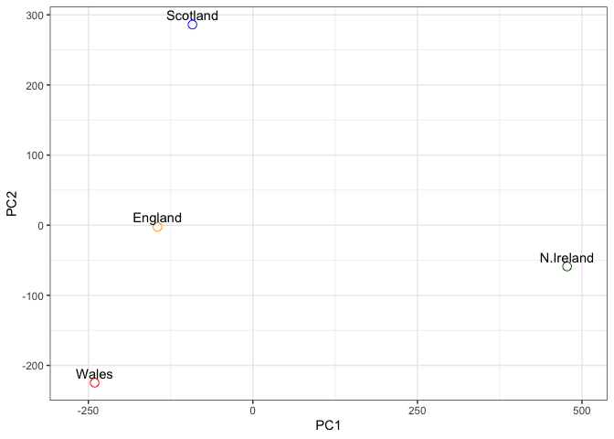
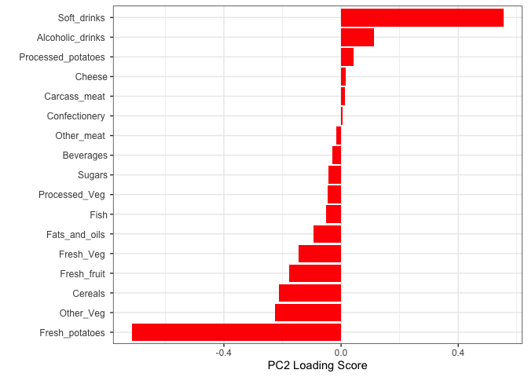

# Class07 Machine Learning 1
Zixuan Zeng (A16142927)

- [Hierarchical Clustering](#hierarchical-clustering)
- [PCA](#pca)
- [PCA to the rescue](#pca-to-the-rescue)
- [RNA-seq data exploration](#rna-seq-data-exploration)

Today we will begin our exploration of some “classical” machine learning
approaches. We will start will clustering:

Let’s first make up some data to cluster where we know what the answer
should be.

``` r
hist( rnorm(1000) )
```



``` r
x <- c(rnorm(30,mean=-3), rnorm(30,mean=3))
y <- rev(x)

x <- cbind(x,y)
head(x)
```

                 x         y
    [1,] -2.801449 3.4035406
    [2,] -2.463900 4.0334149
    [3,] -3.320368 0.8167072
    [4,] -2.922835 2.5785560
    [5,] -1.633847 3.1023298
    [6,] -3.246249 1.8114625

plot x

``` r
plot(x)
```


The main function in “base” R for K-means clustering is called
`kmeas()`.

``` r
k <- kmeans(x, centers=2)
k
```

    K-means clustering with 2 clusters of sizes 30, 30

    Cluster means:
              x         y
    1  2.961660 -2.822481
    2 -2.822481  2.961660

    Clustering vector:
     [1] 2 2 2 2 2 2 2 2 2 2 2 2 2 2 2 2 2 2 2 2 2 2 2 2 2 2 2 2 2 2 1 1 1 1 1 1 1 1
    [39] 1 1 1 1 1 1 1 1 1 1 1 1 1 1 1 1 1 1 1 1 1 1

    Within cluster sum of squares by cluster:
    [1] 65.12353 65.12353
     (between_SS / total_SS =  88.5 %)

    Available components:

    [1] "cluster"      "centers"      "totss"        "withinss"     "tot.withinss"
    [6] "betweenss"    "size"         "iter"         "ifault"      

> Q. How big are the clusters (i.e. their size)?

``` r
k$size
```

    [1] 30 30

> Q. What clusters do my data points reside in?

``` r
k$cluster
```

     [1] 2 2 2 2 2 2 2 2 2 2 2 2 2 2 2 2 2 2 2 2 2 2 2 2 2 2 2 2 2 2 1 1 1 1 1 1 1 1
    [39] 1 1 1 1 1 1 1 1 1 1 1 1 1 1 1 1 1 1 1 1 1 1

> Q. Make a plot of our data colored by cluster assignment(i.e. make a
> result figure)

``` r
plot(x,col=k$cluster)
points(k$centers,col="blue",pch=15)
```



> Q. Cluster with k-means into 4 clustrs and plot your results as above.

``` r
k4 <- kmeans(x, centers=4)
plot(x,col=k4$cluster)
points(k4$centers,col="blue",pch=15)
```



> Q. Run kmeans with center (i.e. values of k) equal 1 to 6

``` r
k1 <- kmeans(x, centers=1)$tot.withinss
k2 <- kmeans(x, centers=2)$tot.withinss
k3 <- kmeans(x, centers=3)$tot.withinss
k4 <- kmeans(x, centers=4)$tot.withinss
k5 <- kmeans(x, centers=5)$tot.withinss
k6 <- kmeans(x, centers=6)$tot.withinss

ans <- c(k1,k2,k3,k4,k5,k6)
```

Or use a `for` loop

``` r
ans <- NULL
for(i in 1:6){
  km <- kmeans(x, centers=i)
  ans[i] <- km$tot.withinss
}
ans
```

    [1] 1133.93558  130.24706  102.94262   75.63818   81.37274   54.01958

Make a “screen-plot”

``` r
plot(ans,typ="b")
```



## Hierarchical Clustering

The main function in “base” R for this is called `hclust()`.

``` r
d <- dist(x)
hc <- hclust(d)
hc
```


    Call:
    hclust(d = d)

    Cluster method   : complete 
    Distance         : euclidean 
    Number of objects: 60 

``` r
plot(hc)
abline(h=7,col="red")
```



To obtain clusters from our `hclust` result object **hc**, we cut the
tree to yield different sub branches For this we use the `cutree()`
function.

``` r
grps <- cutree(hc,h=7)
grps
```

     [1] 1 1 1 1 1 1 1 1 1 1 1 1 1 1 1 1 1 1 1 1 1 1 1 1 1 1 1 1 1 1 2 2 2 2 2 2 2 2
    [39] 2 2 2 2 2 2 2 2 2 2 2 2 2 2 2 2 2 2 2 2 2 2

``` r
plot(x,col=grps)
```



## PCA

``` r
url <- "https://tinyurl.com/UK-foods"
x <- read.csv(url)
```

> Q1. 17 rows and 5 column dim(x)

> Q2. I like the first approach as the code feels more straight-forward
> to me. Running it more than one time could remove the informatin we
> want.

> Q3. beside = FALSE

``` r
rownames(x) <- x[,1]
x <- x[,-1]
head(x)
```

                   England Wales Scotland N.Ireland
    Cheese             105   103      103        66
    Carcass_meat       245   227      242       267
    Other_meat         685   803      750       586
    Fish               147   160      122        93
    Fats_and_oils      193   235      184       209
    Sugars             156   175      147       139

``` r
barplot(as.matrix(x), beside=T, col=rainbow(nrow(x)))
```


``` r
barplot(as.matrix(x), beside=FALSE, col=rainbow(nrow(x)))
```


> Q4. Delete the position = “dodge” argument

``` r
library(tidyr)
library(ggplot2)
x_long <- x |> 
          tibble::rownames_to_column("Food") |> 
          pivot_longer(cols = -Food, 
                       names_to = "Country", 
                       values_to = "Consumption")
ggplot(x_long) +
  aes(x = Country, y = Consumption, fill = Food) +
  geom_col() +
  theme_bw()
```


> Q5. Plots above and below each diagonal countries are replicates. Each
> plot represents compairson between the two countries vertical to the
> plot. Each dot represents a food item. The position of the dot
> represents the consumption amount in each country. The dot would be on
> the diagonal of the plot if two countries consum about the same amount
> of that particular food.

``` r
pairs(x, col=rainbow(nrow(x)), pch=16)
```


``` r
library(pheatmap)
pheatmap( as.matrix(x) )
```


> Q6. Scotland, England, and Wales are clustered together in contrast to
> N.Ireland. This result indicates that N.Ireland has a different food
> consumption pattern than the other three countries. Main differences
> are a little hard to spot since the color is not that different.

## PCA to the rescue

The main function in “base” R for PCA is called `prcomp()`.

As we want to do a PCA on the food data for the different countries, we
will want the foods in the columns.

``` r
PCA <- prcomp(t(x))
summary(PCA)
```

    Importance of components:
                                PC1      PC2      PC3       PC4
    Standard deviation     324.1502 212.7478 73.87622 2.921e-14
    Proportion of Variance   0.6744   0.2905  0.03503 0.000e+00
    Cumulative Proportion    0.6744   0.9650  1.00000 1.000e+00

Our result object is called `PCA` and it has a `$x` component that we
will look at first.

``` r
PCA$x
```

                     PC1         PC2        PC3           PC4
    England   -144.99315   -2.532999 105.768945 -9.152022e-15
    Wales     -240.52915 -224.646925 -56.475555  5.560040e-13
    Scotland   -91.86934  286.081786 -44.415495 -6.638419e-13
    N.Ireland  477.39164  -58.901862  -4.877895  1.329771e-13

``` r
ggplot(PCA$x) + aes(PC1,PC2) + geom_point()
```



> Q7. The finished code is below.

``` r
# Create a data frame for plotting
df <- as.data.frame(PCA$x)
df$Country <- rownames(df)

# Plot PC1 vs PC2 with ggplot
ggplot(PCA$x) +
  aes(x = PC1, y = PC2, label = rownames(PCA$x)) +
  geom_point(size = 3) +
  geom_text(vjust = -0.5) +
  xlim(-270, 500) +
  xlab("PC1") +
  ylab("PC2") +
  theme_bw()
```


> Q8.

``` r
ggplot(PCA$x) +
  aes(x = PC1, y = PC2, label = rownames(PCA$x)) +
  geom_point(size = 3,color=c('orange', 'red', 'blue', 'darkgreen'), pch = 1) +
  geom_text(vjust = -0.5) +
  xlim(-270, 500) +
  xlab("PC1") +
  ylab("PC2") +
  theme_bw()
```



Another major result out of PCA is the so-called “variable loadings” or
`$rotation` that tells us how the original variables (foods) contribute
to PCs.

``` r
ggplot(PCA$rotation) +
  aes(x = PC1, 
      y = reorder(rownames(PCA$rotation), PC1)) +
  geom_col(fill = "steelblue") +
  xlab("PC1 Loading Score") +
  ylab("") +
  theme_bw() +
  theme(axis.text.y = element_text(size = 9))
```


> Q9. Soft drinks and alcoholic drinks feature prominently in PC2. PC2
> mainly tells us that consumption of soft and alcoholic drinks
> separates Scotland from the cluster that contains the rest of three
> countries.

``` r
ggplot(PCA$rotation) +
  aes(x = PC2, 
      y = reorder(rownames(PCA$rotation), PC2)) +
  geom_col(fill = "red") +
  xlab("PC2 Loading Score") +
  ylab("") +
  theme_bw() +
  theme(axis.text.y = element_text(size = 9))
```



## RNA-seq data exploration

> Q10. 100 genes and 10 samples

``` r
url2 <- "https://tinyurl.com/expression-CSV"
rna.data <- read.csv(url2, row.names=1)
head(rna.data)
```

           wt1 wt2  wt3  wt4 wt5 ko1 ko2 ko3 ko4 ko5
    gene1  439 458  408  429 420  90  88  86  90  93
    gene2  219 200  204  210 187 427 423 434 433 426
    gene3 1006 989 1030 1017 973 252 237 238 226 210
    gene4  783 792  829  856 760 849 856 835 885 894
    gene5  181 249  204  244 225 277 305 272 270 279
    gene6  460 502  491  491 493 612 594 577 618 638

``` r
dim(rna.data)
```

    [1] 100  10

``` r
## Again we have to take the transpose of our data 
pca <- prcomp(t(rna.data), scale=TRUE)

# Create data frame for plotting
df <- as.data.frame(pca$x)
df$Sample <- rownames(df)

## Plot with ggplot
ggplot(df) +
  aes(x = PC1, y = PC2, label = Sample) +
  geom_point(size = 3) +
  geom_text(vjust = -0.5, size = 3) +
  xlab("PC1") +
  ylab("PC2") +
  theme_bw() 
```


``` r
summary(pca)
```

    Importance of components:
                              PC1    PC2     PC3     PC4     PC5     PC6     PC7
    Standard deviation     9.6237 1.5198 1.05787 1.05203 0.88062 0.82545 0.80111
    Proportion of Variance 0.9262 0.0231 0.01119 0.01107 0.00775 0.00681 0.00642
    Cumulative Proportion  0.9262 0.9493 0.96045 0.97152 0.97928 0.98609 0.99251
                               PC8     PC9    PC10
    Standard deviation     0.62065 0.60342 3.3e-15
    Proportion of Variance 0.00385 0.00364 0.0e+00
    Cumulative Proportion  0.99636 1.00000 1.0e+00

``` r
# Calculate variance explained
pca.var <- pca$sdev^2
pca.var.per <- round(pca.var/sum(pca.var)*100, 1)

# Create scree plot data
scree_df <- data.frame(
  PC = factor(paste0("PC", 1:10), levels = paste0("PC", 1:10)),
  Variance = pca.var[1:10]
)

ggplot(scree_df) +
  aes(x = PC, y = Variance) +
  geom_col(fill = "steelblue") +
  ggtitle("Quick scree plot") +
  xlab("Principal Component") +
  ylab("Variance") +
  theme_bw()
```


``` r
pca.var.per
```

     [1] 92.6  2.3  1.1  1.1  0.8  0.7  0.6  0.4  0.4  0.0

``` r
# Create percent variance scree plot
scree_pct_df <- data.frame(
  PC = factor(paste0("PC", 1:10), levels = paste0("PC", 1:10)),
  PercentVariation = pca.var.per[1:10]
)

ggplot(scree_pct_df) +
  aes(x = PC, y = PercentVariation) +
  geom_col(fill = "steelblue") +
  ggtitle("Scree Plot") +
  xlab("Principal Component") +
  ylab("Percent Variation") +
  theme_bw()
```


``` r
## A vector of colors for wt and ko samples
colvec <- colnames(rna.data)
colvec[grep("wt", colvec)] <- "red"
colvec[grep("ko", colvec)] <- "blue"

# Add condition to data frame
df$condition <- substr(df$Sample, 1, 2)
df$color <- colvec

ggplot(df) +
  aes(x = PC1, y = PC2, color = color, label = Sample) +
  geom_point(size = 3) +
  geom_text(vjust = -0.5, hjust = 0.5, show.legend = FALSE) +
  scale_color_identity() +
  xlab(paste0("PC1 (", pca.var.per[1], "%)")) +
  ylab(paste0("PC2 (", pca.var.per[2], "%)")) +
  theme_bw()
```


``` r
loading_scores <- pca$rotation[,1]

## Find the top 10 measurements (genes) that contribute
## most to PC1 in either direction (+ or -)
gene_scores <- abs(loading_scores) 
gene_score_ranked <- sort(gene_scores, decreasing=TRUE)

## show the names of the top 10 genes
top_10_genes <- names(gene_score_ranked[1:10])
top_10_genes 
```

     [1] "gene100" "gene66"  "gene45"  "gene68"  "gene98"  "gene60"  "gene21" 
     [8] "gene56"  "gene10"  "gene90" 

``` r
ggplot(pca$rotation) +
  aes(x = PC1, 
      y = reorder(rownames(pca$rotation), PC1)) +
  geom_col(fill = "steelblue") +
  xlab("PC1 Loading Score") +
  ylab("") +
  theme_bw() +
  theme(axis.text.y = element_text(size = 9))
```


