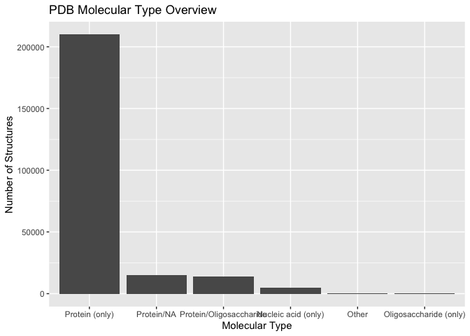
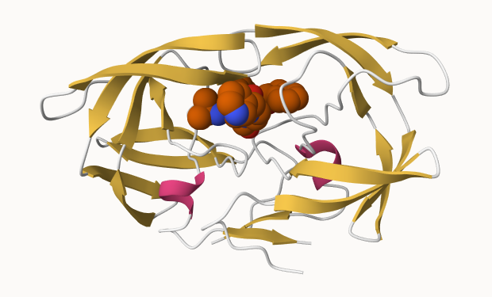
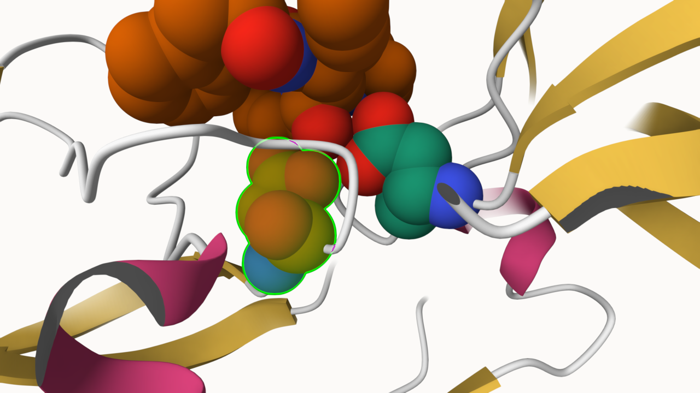
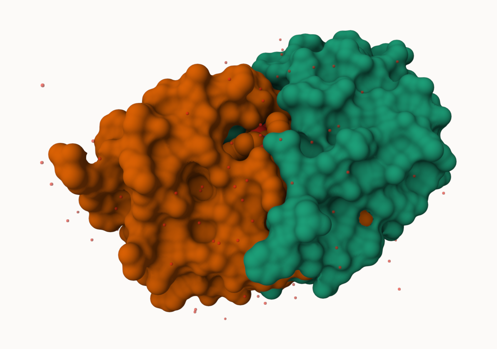

# Class09_Structural1
Zixuan Zeng (A16142927)

- [PDB statistics](#pdb-statistics)
- [Introduction to Bio3D in R](#introduction-to-bio3d-in-r)
- [Prediction of funtional motions (Normal mode
  analysis)](#prediction-of-funtional-motions-normal-mode-analysis)
- [Comparative analysis of protein
  structures](#comparative-analysis-of-protein-structures)

## PDB statistics

``` r
PDBstat <- read.csv("Data_Export_Summary.csv", row.names = 1)
PDBstat
```

                              X.ray     EM    NMR Integrative Multiple.methods
    Protein (only)          176,204 20,299 12,708         342              218
    Protein/Oligosaccharide  10,279  3,385     34           8               11
    Protein/NA                9,007  5,897    287          24                7
    Nucleic acid (only)       3,066    200  1,553           2               15
    Other                       173     13     33           3                0
    Oligosaccharide (only)       11      0      6           0                1
                            Neutron Other   Total
    Protein (only)               83    32 209,886
    Protein/Oligosaccharide       1     0  13,718
    Protein/NA                    0     0  15,222
    Nucleic acid (only)           3     1   4,840
    Other                         0     0     222
    Oligosaccharide (only)        0     4      22

``` r
# Convert numeric-looking columns from character to numeric
PDBstat[] <- lapply(PDBstat, function(x) as.numeric(gsub(",", "", x)))

# Check structure
str(PDBstat)
```

    'data.frame':   6 obs. of  8 variables:
     $ X.ray           : num  176204 10279 9007 3066 173 ...
     $ EM              : num  20299 3385 5897 200 13 ...
     $ NMR             : num  12708 34 287 1553 33 ...
     $ Integrative     : num  342 8 24 2 3 0
     $ Multiple.methods: num  218 11 7 15 0 1
     $ Neutron         : num  83 1 0 3 0 0
     $ Other           : num  32 0 0 1 0 4
     $ Total           : num  209886 13718 15222 4840 222 ...

``` r
X.ray <- as.numeric(sub(",","",PDBstat$X.ray))
EM <- as.numeric(sub(",","",PDBstat$EM))
Total <- as.numeric(sub(",","",PDBstat$Total))
```

``` r
library(readr)
stats <- read_csv("Data_Export_Summary.csv")
```

    Rows: 6 Columns: 9
    ── Column specification ────────────────────────────────────────────────────────
    Delimiter: ","
    chr (1): Molecular Type
    dbl (4): Integrative, Multiple methods, Neutron, Other
    num (4): X-ray, EM, NMR, Total

    ℹ Use `spec()` to retrieve the full column specification for this data.
    ℹ Specify the column types or set `show_col_types = FALSE` to quiet this message.

``` r
stats
```

    # A tibble: 6 × 9
      `Molecular Type`    `X-ray`    EM   NMR Integrative `Multiple methods` Neutron
      <chr>                 <dbl> <dbl> <dbl>       <dbl>              <dbl>   <dbl>
    1 Protein (only)       176204 20299 12708         342                218      83
    2 Protein/Oligosacch…   10279  3385    34           8                 11       1
    3 Protein/NA             9007  5897   287          24                  7       0
    4 Nucleic acid (only)    3066   200  1553           2                 15       3
    5 Other                   173    13    33           3                  0       0
    6 Oligosaccharide (o…      11     0     6           0                  1       0
    # ℹ 2 more variables: Other <dbl>, Total <dbl>

``` r
n.total <-sum(stats$Total)
n.xray <- sum(stats$'X-ray')
n.em <- sum(stats$EM)
round(n.xray/n.total * 100, 2) + round(n.em/n.total * 100, 2)
```

    [1] 93.7

> Q1. 93.7% of the structures in the PDB were determined by X-ray and
> EM.

``` r
stats$Total[1]/sum(stats$Total) * 100
```

    [1] 86.05059

> Q2. 86.05% of the structures in the PDB contain protein only.

> Q2b. Figure shown below

``` r
library(ggplot2)
ggplot(stats, aes(x=reorder(`Molecular Type`,-Total), Total)) + geom_bar(stat="identity") + labs(title="PDB Molecular Type Overview", x="Molecular Type", y="Number of Structures")
```



> Q3. 4866 structures found for HIV-1 protease in the current pdb.

``` r

```


``` r

```

.png)

> Q4. We can only see the oxygen atom from a water molecule because of
> the resolution of the structure. Hydrogen atom is not observed at this
> resolution.

``` r

```

.png)

## Introduction to Bio3D in R

``` r
library(bio3d)
hiv <- read.pdb("1HSG")
```

      Note: Accessing on-line PDB file

``` r
hiv
```


     Call:  read.pdb(file = "1HSG")

       Total Models#: 1
         Total Atoms#: 1686,  XYZs#: 5058  Chains#: 2  (values: A B)

         Protein Atoms#: 1514  (residues/Calpha atoms#: 198)
         Nucleic acid Atoms#: 0  (residues/phosphate atoms#: 0)

         Non-protein/nucleic Atoms#: 172  (residues: 128)
         Non-protein/nucleic resid values: [ HOH (127), MK1 (1) ]

       Protein sequence:
          PQITLWQRPLVTIKIGGQLKEALLDTGADDTVLEEMSLPGRWKPKMIGGIGGFIKVRQYD
          QILIEICGHKAIGTVLVGPTPVNIIGRNLLTQIGCTLNFPQITLWQRPLVTIKIGGQLKE
          ALLDTGADDTVLEEMSLPGRWKPKMIGGIGGFIKVRQYDQILIEICGHKAIGTVLVGPTP
          VNIIGRNLLTQIGCTLNF

    + attr: atom, xyz, seqres, helix, sheet,
            calpha, remark, call

``` r
attributes(hiv)
```

    $names
    [1] "atom"   "xyz"    "seqres" "helix"  "sheet"  "calpha" "remark" "call"  

    $class
    [1] "pdb" "sse"

``` r
head(hiv$atom)
```

      type eleno elety  alt resid chain resno insert      x      y     z o     b
    1 ATOM     1     N <NA>   PRO     A     1   <NA> 29.361 39.686 5.862 1 38.10
    2 ATOM     2    CA <NA>   PRO     A     1   <NA> 30.307 38.663 5.319 1 40.62
    3 ATOM     3     C <NA>   PRO     A     1   <NA> 29.760 38.071 4.022 1 42.64
    4 ATOM     4     O <NA>   PRO     A     1   <NA> 28.600 38.302 3.676 1 43.40
    5 ATOM     5    CB <NA>   PRO     A     1   <NA> 30.508 37.541 6.342 1 37.87
    6 ATOM     6    CG <NA>   PRO     A     1   <NA> 29.296 37.591 7.162 1 38.40
      segid elesy charge
    1  <NA>     N   <NA>
    2  <NA>     C   <NA>
    3  <NA>     C   <NA>
    4  <NA>     O   <NA>
    5  <NA>     C   <NA>
    6  <NA>     C   <NA>

``` r
pdbseq(hiv) #for both chaim A and B
```

      1   2   3   4   5   6   7   8   9  10  11  12  13  14  15  16  17  18  19  20 
    "P" "Q" "I" "T" "L" "W" "Q" "R" "P" "L" "V" "T" "I" "K" "I" "G" "G" "Q" "L" "K" 
     21  22  23  24  25  26  27  28  29  30  31  32  33  34  35  36  37  38  39  40 
    "E" "A" "L" "L" "D" "T" "G" "A" "D" "D" "T" "V" "L" "E" "E" "M" "S" "L" "P" "G" 
     41  42  43  44  45  46  47  48  49  50  51  52  53  54  55  56  57  58  59  60 
    "R" "W" "K" "P" "K" "M" "I" "G" "G" "I" "G" "G" "F" "I" "K" "V" "R" "Q" "Y" "D" 
     61  62  63  64  65  66  67  68  69  70  71  72  73  74  75  76  77  78  79  80 
    "Q" "I" "L" "I" "E" "I" "C" "G" "H" "K" "A" "I" "G" "T" "V" "L" "V" "G" "P" "T" 
     81  82  83  84  85  86  87  88  89  90  91  92  93  94  95  96  97  98  99   1 
    "P" "V" "N" "I" "I" "G" "R" "N" "L" "L" "T" "Q" "I" "G" "C" "T" "L" "N" "F" "P" 
      2   3   4   5   6   7   8   9  10  11  12  13  14  15  16  17  18  19  20  21 
    "Q" "I" "T" "L" "W" "Q" "R" "P" "L" "V" "T" "I" "K" "I" "G" "G" "Q" "L" "K" "E" 
     22  23  24  25  26  27  28  29  30  31  32  33  34  35  36  37  38  39  40  41 
    "A" "L" "L" "D" "T" "G" "A" "D" "D" "T" "V" "L" "E" "E" "M" "S" "L" "P" "G" "R" 
     42  43  44  45  46  47  48  49  50  51  52  53  54  55  56  57  58  59  60  61 
    "W" "K" "P" "K" "M" "I" "G" "G" "I" "G" "G" "F" "I" "K" "V" "R" "Q" "Y" "D" "Q" 
     62  63  64  65  66  67  68  69  70  71  72  73  74  75  76  77  78  79  80  81 
    "I" "L" "I" "E" "I" "C" "G" "H" "K" "A" "I" "G" "T" "V" "L" "V" "G" "P" "T" "P" 
     82  83  84  85  86  87  88  89  90  91  92  93  94  95  96  97  98  99 
    "V" "N" "I" "I" "G" "R" "N" "L" "L" "T" "Q" "I" "G" "C" "T" "L" "N" "F" 

``` r
chainA<-trim.pdb(hiv, chain="A")
chainA.seq <- pdbseq(chainA)
```

``` r
#Blast chain A
blast <- blast.pdb(chainA.seq)
```

     Searching ... please wait (updates every 5 seconds) RID = K6UFZHK2016 
     ..
     Reporting 249 hits

``` r
head(blast$hit.tbl)
```

            queryid subjectids identity alignmentlength mismatches gapopens q.start
    1 Query_5691081     1W5V_A   100.00              99          0        0       1
    2 Query_5691081     2FDE_A   100.00              99          0        0       1
    3 Query_5691081     1AJV_A   100.00              99          0        0       1
    4 Query_5691081     2R38_A    98.99              99          1        0       1
    5 Query_5691081     2R3T_A    98.99              99          1        0       1
    6 Query_5691081     1HXB_A    98.99              99          1        0       1
      q.end s.start s.end   evalue bitscore positives mlog.evalue pdb.id    acc
    1    99      12   110 1.40e-67      199       100    153.9367 1W5V_A 1W5V_A
    2    99       2   100 1.73e-67      198       100    153.7251 2FDE_A 2FDE_A
    3    99       1    99 2.02e-67      198       100    153.5701 1AJV_A 1AJV_A
    4    99       1    99 2.55e-67      198       100    153.3371 2R38_A 2R38_A
    5    99       1    99 2.55e-67      198       100    153.3371 2R3T_A 2R3T_A
    6    99       1    99 2.55e-67      198       100    153.3371 1HXB_A 1HXB_A

``` r
hits <- plot(blast)
```

      * Possible cutoff values:    123 110 69 -2 
                Yielding Nhits:    224 238 244 249 

      * Chosen cutoff value of:    69 
                Yielding Nhits:    244 


``` r
hits$pdb.id
```

      [1] "1W5V_A" "2FDE_A" "1AJV_A" "2R38_A" "2R3T_A" "1HXB_A" "1BV9_A" "1AAQ_A"
      [9] "1AXA_A" "1HVS_A" "1ZP8_A" "2QHC_A" "1A8G_A" "2O4L_A" "5COK_A" "1TCX_A"
     [17] "2Z54_A" "1D4S_A" "1BV7_A" "1BWA_A" "1A9M_A" "2FLE_A" "1ODY_A" "1GNN_A"
     [25] "1GNM_A" "5YRS_B" "1HEF_E" "1ODX_A" "4QGI_A" "1BVE_A" "2AZ8_A" "1A30_A"
     [33] "6DH6_A" "6DH0_A" "2I4D_A" "6OOS_A" "1RL8_A" "5YRS_A" "1ZSF_A" "2Q64_A"
     [41] "6DH3_A" "2NPH_A" "2Q63_A" "1LZQ_A" "1FB7_A" "1G6L_A" "1HIV_A" "6OOU_A"
     [49] "1HVC_A" "2I4V_A" "2AZ9_A" "6OOT_A" "2P3B_B" "5KAO_A" "2WL0_A" "6OPT_A"
     [57] "1IZI_A" "1MRX_A" "2PYM_A" "2PYN_A" "1DMP_A" "4K4P_A" "1LV1_A" "1AID_A"
     [65] "1LV1_A" "1ZBG_A" "3TKG_A" "1HVC_A" "5YOK_A" "1G6L_A" "1FGC_C" "3K4V_A"
     [73] "3KT5_A" "3KT5_A" "4QLH_A" "4QLH_A" "2F3K_A" "4Q5M_A" "2AOC_A" "3B80_A"
     [81] "3VF5_A" "2AVQ_A" "1DW6_C" "1KZK_A" "2HS1_A" "1K6C_A" "1MTB_A" "4Q1X_A"
     [89] "4Q1W_A" "4Q5M_A" "3D1X_A" "2AVM_A" "3PWM_A" "3KT2_A" "3KT2_A" "1SDV_A"
     [97] "3JVW_A" "3OY4_A" "1A94_A" "2HS2_A" "4EJ8_A" "2FGU_A" "2AVV_A" "3JW2_A"
    [105] "3BVA_A" "1FFF_C" "3S43_B" "2NXD_A" "1FG6_C" "1EBK_C" "4Q1Y_A" "3EL4_A"
    [113] "1F7A_A" "1K2B_A" "2FGV_A" "1Z8C_A" "2G69_A" "3EL9_A" "3OXV_A" "1BDR_A"
    [121] "3N3I_A" "3N3I_A" "3OXW_A" "3S43_A" "3EM3_A" "3CYW_A" "5KQX_A" "2B60_A"
    [129] "7DOZ_A" "1K2C_A" "1MT7_A" "3EM4_A" "4QJ9_A" "1BDL_A" "3LZS_A" "5T84_A"
    [137] "4DQB_A" "7DOZ_A" "4QJ2_A" "3LZV_A" "1SGU_A" "2FXE_A" "1BDQ_A" "3U71_A"
    [145] "2R5P_A" "4OBD_A" "7MAS_A" "3IXO_A" "3D3T_A" "5YOJ_A" "3LZU_A" "4NJS_A"
    [153] "3EKP_A" "1B6J_A" "3EKQ_A" "2RKF_A" "1C6X_A" "7MAR_A" "4DQF_A" "1RPI_A"
    [161] "3OU1_B" "3PJ6_A" "2P3A_A" "6OGQ_A" "3OQ7_A" "5KR1_A" "3OQD_A" "4RVI_A"
    [169] "3OQA_A" "1B6K_A" "3OUD_B" "6MK9_A" "3SO9_A" "1Q9P_A" "6I45_A" "7SEP_A"
    [177] "4NJT_A" "3BXR_A" "4YOA_A" "4DQC_A" "2FDD_A" "2RKG_A" "4DQH_A" "2P3C_A"
    [185] "4EP2_A" "4EP2_A" "4EQ0_A" "4NPT_A" "6OPU_A" "4NPU_A" "3U7S_A" "3HAW_A"
    [193] "2AZB_A" "3TTP_A" "3HBO_A" "3GGU_A" "7N6T_A" "6OPV_A" "4EQ0_A" "6OPX_A"
    [201] "2O4N_A" "5T2E_A" "3UCB_A" "3KA2_A" "3FSM_A" "6OPW_A" "2AZC_A" "3FSM_A"
    [209] "3HLO_A" "2P3D_A" "3T3C_A" "7MYP_A" "6O54_X" "6OPY_A" "4Z4X_A" "6OPZ_A"
    [217] "2JE4_A" "1DAZ_C" "7MAP_A" "7MAQ_A" "1K1U_A" "2B7Z_A" "3MWS_A" "1K1T_A"
    [225] "8DCH_A" "3I2L_A" "6P9A_A" "2FXD_A" "2J9J_A" "3DCK_A" "2J9J_B" "3NXE_A"
    [233] "2O40_A" "2O40_A" "3NXE_A" "3KA2_A" "3HLO_A" "5B18_A" "1SIP_A" "2SAM_A"
    [241] "1AZ5_A" "1SIV_A" "1HII_A" "1IVP_A"

## Prediction of funtional motions (Normal mode analysis)

``` r
adk <- read.pdb("1ake")
```

      Note: Accessing on-line PDB file
       PDB has ALT records, taking A only, rm.alt=TRUE

``` r
adk_A <- trim.pdb(adk, chain="A")
adk_A
```


     Call:  trim.pdb(pdb = adk, chain = "A")

       Total Models#: 1
         Total Atoms#: 1954,  XYZs#: 5862  Chains#: 1  (values: A)

         Protein Atoms#: 1656  (residues/Calpha atoms#: 214)
         Nucleic acid Atoms#: 0  (residues/phosphate atoms#: 0)

         Non-protein/nucleic Atoms#: 298  (residues: 242)
         Non-protein/nucleic resid values: [ AP5 (1), HOH (241) ]

       Protein sequence:
          MRIILLGAPGAGKGTQAQFIMEKYGIPQISTGDMLRAAVKSGSELGKQAKDIMDAGKLVT
          DELVIALVKERIAQEDCRNGFLLDGFPRTIPQADAMKEAGINVDYVLEFDVPDELIVDRI
          VGRRVHAPSGRVYHVKFNPPKVEGKDDVTGEELTTRKDDQEETVRKRLVEYHQMTAPLIG
          YYSKEAEAGNTKYAKVDGTKPVAEVRADLEKILG

    + attr: atom, helix, sheet, seqres, xyz,
            calpha, call

``` r
m <- nma(adk_A)
```

     Building Hessian...        Done in 0.011 seconds.
     Diagonalizing Hessian...   Done in 0.257 seconds.

``` r
plot(m)
```


## Comparative analysis of protein structures

Starting with a sequence or structure ID (accession number), let’s run a
complete analysis pipeline.

``` r
library(bio3d)
id <- "1ake_A"

aa <- get.seq(id)
```

    Warning in get.seq(id): Removing existing file: seqs.fasta

    Fetching... Please wait. Done.

``` r
aa
```

                 1        .         .         .         .         .         60 
    pdb|1AKE|A   MRIILLGAPGAGKGTQAQFIMEKYGIPQISTGDMLRAAVKSGSELGKQAKDIMDAGKLVT
                 1        .         .         .         .         .         60 

                61        .         .         .         .         .         120 
    pdb|1AKE|A   DELVIALVKERIAQEDCRNGFLLDGFPRTIPQADAMKEAGINVDYVLEFDVPDELIVDRI
                61        .         .         .         .         .         120 

               121        .         .         .         .         .         180 
    pdb|1AKE|A   VGRRVHAPSGRVYHVKFNPPKVEGKDDVTGEELTTRKDDQEETVRKRLVEYHQMTAPLIG
               121        .         .         .         .         .         180 

               181        .         .         .   214 
    pdb|1AKE|A   YYSKEAEAGNTKYAKVDGTKPVAEVRADLEKILG
               181        .         .         .   214 

    Call:
      read.fasta(file = outfile)

    Class:
      fasta

    Alignment dimensions:
      1 sequence rows; 214 position columns (214 non-gap, 0 gap) 

    + attr: id, ali, call

``` r
blast <- blast.pdb(aa)
```

     Searching ... please wait (updates every 5 seconds) RID = K6UGGMH6014 
     ..
     Reporting 96 hits

``` r
hits <- plot(blast)
```

      * Possible cutoff values:    260 3 
                Yielding Nhits:    20 96 

      * Chosen cutoff value of:    260 
                Yielding Nhits:    20 


``` r
hits$pdb.id
```

     [1] "1AKE_A" "8BQF_A" "4X8M_A" "6S36_A" "9R6U_A" "9R71_A" "8Q2B_A" "8RJ9_A"
     [9] "6RZE_A" "4X8H_A" "3HPR_A" "1E4V_A" "5EJE_A" "1E4Y_A" "3X2S_A" "6HAP_A"
    [17] "6HAM_A" "8PVW_A" "4K46_A" "4NP6_A"

``` r
# Download releated PDB files
files <- get.pdb(hits$pdb.id, path="pdbs", split=TRUE, gzip=TRUE)
```

    Warning in get.pdb(hits$pdb.id, path = "pdbs", split = TRUE, gzip = TRUE):
    pdbs/1AKE.pdb.gz exists. Skipping download

    Warning in get.pdb(hits$pdb.id, path = "pdbs", split = TRUE, gzip = TRUE):
    pdbs/8BQF.pdb.gz exists. Skipping download

    Warning in get.pdb(hits$pdb.id, path = "pdbs", split = TRUE, gzip = TRUE):
    pdbs/4X8M.pdb.gz exists. Skipping download

    Warning in get.pdb(hits$pdb.id, path = "pdbs", split = TRUE, gzip = TRUE):
    pdbs/6S36.pdb.gz exists. Skipping download

    Warning in get.pdb(hits$pdb.id, path = "pdbs", split = TRUE, gzip = TRUE):
    pdbs/8Q2B.pdb.gz exists. Skipping download

    Warning in get.pdb(hits$pdb.id, path = "pdbs", split = TRUE, gzip = TRUE):
    pdbs/8RJ9.pdb.gz exists. Skipping download

    Warning in get.pdb(hits$pdb.id, path = "pdbs", split = TRUE, gzip = TRUE):
    pdbs/6RZE.pdb.gz exists. Skipping download

    Warning in get.pdb(hits$pdb.id, path = "pdbs", split = TRUE, gzip = TRUE):
    pdbs/4X8H.pdb.gz exists. Skipping download

    Warning in get.pdb(hits$pdb.id, path = "pdbs", split = TRUE, gzip = TRUE):
    pdbs/3HPR.pdb.gz exists. Skipping download

    Warning in get.pdb(hits$pdb.id, path = "pdbs", split = TRUE, gzip = TRUE):
    pdbs/1E4V.pdb.gz exists. Skipping download

    Warning in get.pdb(hits$pdb.id, path = "pdbs", split = TRUE, gzip = TRUE):
    pdbs/5EJE.pdb.gz exists. Skipping download

    Warning in get.pdb(hits$pdb.id, path = "pdbs", split = TRUE, gzip = TRUE):
    pdbs/1E4Y.pdb.gz exists. Skipping download

    Warning in get.pdb(hits$pdb.id, path = "pdbs", split = TRUE, gzip = TRUE):
    pdbs/3X2S.pdb.gz exists. Skipping download

    Warning in get.pdb(hits$pdb.id, path = "pdbs", split = TRUE, gzip = TRUE):
    pdbs/6HAP.pdb.gz exists. Skipping download

    Warning in get.pdb(hits$pdb.id, path = "pdbs", split = TRUE, gzip = TRUE):
    pdbs/6HAM.pdb.gz exists. Skipping download

    Warning in get.pdb(hits$pdb.id, path = "pdbs", split = TRUE, gzip = TRUE):
    pdbs/8PVW.pdb.gz exists. Skipping download

    Warning in get.pdb(hits$pdb.id, path = "pdbs", split = TRUE, gzip = TRUE):
    pdbs/4K46.pdb.gz exists. Skipping download

    Warning in get.pdb(hits$pdb.id, path = "pdbs", split = TRUE, gzip = TRUE):
    pdbs/4NP6.pdb.gz exists. Skipping download


      |                                                                            
      |                                                                      |   0%
      |                                                                            
      |====                                                                  |   5%
      |                                                                            
      |=======                                                               |  10%
      |                                                                            
      |==========                                                            |  15%
      |                                                                            
      |==============                                                        |  20%
      |                                                                            
      |==================                                                    |  25%
      |                                                                            
      |=====================                                                 |  30%
      |                                                                            
      |========================                                              |  35%
      |                                                                            
      |============================                                          |  40%
      |                                                                            
      |================================                                      |  45%
      |                                                                            
      |===================================                                   |  50%
      |                                                                            
      |======================================                                |  55%
      |                                                                            
      |==========================================                            |  60%
      |                                                                            
      |==============================================                        |  65%
      |                                                                            
      |=================================================                     |  70%
      |                                                                            
      |====================================================                  |  75%
      |                                                                            
      |========================================================              |  80%
      |                                                                            
      |============================================================          |  85%
      |                                                                            
      |===============================================================       |  90%
      |                                                                            
      |==================================================================    |  95%
      |                                                                            
      |======================================================================| 100%

``` r
# Align releated PDBs
pdbs <- pdbaln(files, fit = TRUE, exefile="msa")
```

    Reading PDB files:
    pdbs/split_chain/1AKE_A.pdb
    pdbs/split_chain/8BQF_A.pdb
    pdbs/split_chain/4X8M_A.pdb
    pdbs/split_chain/6S36_A.pdb
    pdbs/split_chain/9R6U_A.pdb
    pdbs/split_chain/9R71_A.pdb
    pdbs/split_chain/8Q2B_A.pdb
    pdbs/split_chain/8RJ9_A.pdb
    pdbs/split_chain/6RZE_A.pdb
    pdbs/split_chain/4X8H_A.pdb
    pdbs/split_chain/3HPR_A.pdb
    pdbs/split_chain/1E4V_A.pdb
    pdbs/split_chain/5EJE_A.pdb
    pdbs/split_chain/1E4Y_A.pdb
    pdbs/split_chain/3X2S_A.pdb
    pdbs/split_chain/6HAP_A.pdb
    pdbs/split_chain/6HAM_A.pdb
    pdbs/split_chain/8PVW_A.pdb
    pdbs/split_chain/4K46_A.pdb
    pdbs/split_chain/4NP6_A.pdb
       PDB has ALT records, taking A only, rm.alt=TRUE
    .   PDB has ALT records, taking A only, rm.alt=TRUE
    ..   PDB has ALT records, taking A only, rm.alt=TRUE
    .   PDB has ALT records, taking A only, rm.alt=TRUE
    .   PDB has ALT records, taking A only, rm.alt=TRUE
    .   PDB has ALT records, taking A only, rm.alt=TRUE
    .   PDB has ALT records, taking A only, rm.alt=TRUE
    .   PDB has ALT records, taking A only, rm.alt=TRUE
    ..   PDB has ALT records, taking A only, rm.alt=TRUE
    ..   PDB has ALT records, taking A only, rm.alt=TRUE
    ....   PDB has ALT records, taking A only, rm.alt=TRUE
    .   PDB has ALT records, taking A only, rm.alt=TRUE
    .   PDB has ALT records, taking A only, rm.alt=TRUE
    ..

    Extracting sequences

    pdb/seq: 1   name: pdbs/split_chain/1AKE_A.pdb 
       PDB has ALT records, taking A only, rm.alt=TRUE
    pdb/seq: 2   name: pdbs/split_chain/8BQF_A.pdb 
       PDB has ALT records, taking A only, rm.alt=TRUE
    pdb/seq: 3   name: pdbs/split_chain/4X8M_A.pdb 
    pdb/seq: 4   name: pdbs/split_chain/6S36_A.pdb 
       PDB has ALT records, taking A only, rm.alt=TRUE
    pdb/seq: 5   name: pdbs/split_chain/9R6U_A.pdb 
       PDB has ALT records, taking A only, rm.alt=TRUE
    pdb/seq: 6   name: pdbs/split_chain/9R71_A.pdb 
       PDB has ALT records, taking A only, rm.alt=TRUE
    pdb/seq: 7   name: pdbs/split_chain/8Q2B_A.pdb 
       PDB has ALT records, taking A only, rm.alt=TRUE
    pdb/seq: 8   name: pdbs/split_chain/8RJ9_A.pdb 
       PDB has ALT records, taking A only, rm.alt=TRUE
    pdb/seq: 9   name: pdbs/split_chain/6RZE_A.pdb 
       PDB has ALT records, taking A only, rm.alt=TRUE
    pdb/seq: 10   name: pdbs/split_chain/4X8H_A.pdb 
    pdb/seq: 11   name: pdbs/split_chain/3HPR_A.pdb 
       PDB has ALT records, taking A only, rm.alt=TRUE
    pdb/seq: 12   name: pdbs/split_chain/1E4V_A.pdb 
    pdb/seq: 13   name: pdbs/split_chain/5EJE_A.pdb 
       PDB has ALT records, taking A only, rm.alt=TRUE
    pdb/seq: 14   name: pdbs/split_chain/1E4Y_A.pdb 
    pdb/seq: 15   name: pdbs/split_chain/3X2S_A.pdb 
    pdb/seq: 16   name: pdbs/split_chain/6HAP_A.pdb 
    pdb/seq: 17   name: pdbs/split_chain/6HAM_A.pdb 
       PDB has ALT records, taking A only, rm.alt=TRUE
    pdb/seq: 18   name: pdbs/split_chain/8PVW_A.pdb 
       PDB has ALT records, taking A only, rm.alt=TRUE
    pdb/seq: 19   name: pdbs/split_chain/4K46_A.pdb 
       PDB has ALT records, taking A only, rm.alt=TRUE
    pdb/seq: 20   name: pdbs/split_chain/4NP6_A.pdb 

``` r
# Vector containing PDB codes for figure axis
ids <- basename.pdb(pdbs$id)

# Draw schematic alignment
#plot(pdbs, labels=ids)
```

``` r
anno <- pdb.annotate(ids)
unique(anno$source)
```

    [1] "Escherichia coli"                            
    [2] "Escherichia coli K-12"                       
    [3] "Escherichia coli O139:H28 str. E24377A"      
    [4] "Escherichia coli str. K-12 substr. MDS42"    
    [5] "Photobacterium profundum"                    
    [6] "Vibrio cholerae O1 biovar El Tor str. N16961"

``` r
anno
```

           structureId chainId macromoleculeType chainLength experimentalTechnique
    1AKE_A        1AKE       A           Protein         214                 X-ray
    8BQF_A        8BQF       A           Protein         234                 X-ray
    4X8M_A        4X8M       A           Protein         214                 X-ray
    6S36_A        6S36       A           Protein         214                 X-ray
    9R6U_A        9R6U       A           Protein         214                 X-ray
    9R71_A        9R71       A           Protein         214                 X-ray
    8Q2B_A        8Q2B       A           Protein         214                 X-ray
    8RJ9_A        8RJ9       A           Protein         214                 X-ray
    6RZE_A        6RZE       A           Protein         214                 X-ray
    4X8H_A        4X8H       A           Protein         214                 X-ray
    3HPR_A        3HPR       A           Protein         214                 X-ray
    1E4V_A        1E4V       A           Protein         214                 X-ray
    5EJE_A        5EJE       A           Protein         214                 X-ray
    1E4Y_A        1E4Y       A           Protein         214                 X-ray
    3X2S_A        3X2S       A           Protein         214                 X-ray
    6HAP_A        6HAP       A           Protein         214                 X-ray
    6HAM_A        6HAM       A           Protein         214                 X-ray
    8PVW_A        8PVW       A           Protein         187                 X-ray
    4K46_A        4K46       A           Protein         214                 X-ray
    4NP6_A        4NP6       A           Protein         217                 X-ray
           resolution       scopDomain                                        pfam
    1AKE_A      2.000 Adenylate kinase Adenylate kinase, active site lid (ADK_lid)
    8BQF_A      2.050             <NA>                      Adenylate kinase (ADK)
    4X8M_A      2.600             <NA> Adenylate kinase, active site lid (ADK_lid)
    6S36_A      1.600             <NA> Adenylate kinase, active site lid (ADK_lid)
    9R6U_A      1.770             <NA>                      Adenylate kinase (ADK)
    9R71_A      1.610             <NA>                      Adenylate kinase (ADK)
    8Q2B_A      1.760             <NA>                      Adenylate kinase (ADK)
    8RJ9_A      1.590             <NA> Adenylate kinase, active site lid (ADK_lid)
    6RZE_A      1.690             <NA> Adenylate kinase, active site lid (ADK_lid)
    4X8H_A      2.500             <NA>                      Adenylate kinase (ADK)
    3HPR_A      2.000             <NA>                      Adenylate kinase (ADK)
    1E4V_A      1.850 Adenylate kinase Adenylate kinase, active site lid (ADK_lid)
    5EJE_A      1.900             <NA>                      Adenylate kinase (ADK)
    1E4Y_A      1.850 Adenylate kinase                      Adenylate kinase (ADK)
    3X2S_A      2.800             <NA>                      Adenylate kinase (ADK)
    6HAP_A      2.700             <NA> Adenylate kinase, active site lid (ADK_lid)
    6HAM_A      2.550             <NA>                      Adenylate kinase (ADK)
    8PVW_A      2.000             <NA>                      Adenylate kinase (ADK)
    4K46_A      2.010             <NA> Adenylate kinase, active site lid (ADK_lid)
    4NP6_A      2.004             <NA> Adenylate kinase, active site lid (ADK_lid)
                   ligandId
    1AKE_A              AP5
    8BQF_A              AP5
    4X8M_A             <NA>
    6S36_A CL (3),NA,MG (2)
    9R6U_A       AP5,GOL,NA
    9R71_A              AP5
    8Q2B_A      AP5,SO4,MPO
    8RJ9_A          ADP (2)
    6RZE_A    NA (3),CL (2)
    4X8H_A             <NA>
    3HPR_A              AP5
    1E4V_A              AP5
    5EJE_A           AP5,CO
    1E4Y_A              AP5
    3X2S_A   JPY (2),AP5,MG
    6HAP_A              AP5
    6HAM_A              AP5
    8PVW_A              AP5
    4K46_A      ADP,AMP,PO4
    4NP6_A             <NA>
                                                                                  ligandName
    1AKE_A                                                  BIS(ADENOSINE)-5'-PENTAPHOSPHATE
    8BQF_A                                                  BIS(ADENOSINE)-5'-PENTAPHOSPHATE
    4X8M_A                                                                              <NA>
    6S36_A                                     CHLORIDE ION (3),SODIUM ION,MAGNESIUM ION (2)
    9R6U_A                              BIS(ADENOSINE)-5'-PENTAPHOSPHATE,GLYCEROL,SODIUM ION
    9R71_A                                                  BIS(ADENOSINE)-5'-PENTAPHOSPHATE
    8Q2B_A BIS(ADENOSINE)-5'-PENTAPHOSPHATE,SULFATE ION,3[N-MORPHOLINO]PROPANE SULFONIC ACID
    8RJ9_A                                                      ADENOSINE-5'-DIPHOSPHATE (2)
    6RZE_A                                                   SODIUM ION (3),CHLORIDE ION (2)
    4X8H_A                                                                              <NA>
    3HPR_A                                                  BIS(ADENOSINE)-5'-PENTAPHOSPHATE
    1E4V_A                                                  BIS(ADENOSINE)-5'-PENTAPHOSPHATE
    5EJE_A                                  BIS(ADENOSINE)-5'-PENTAPHOSPHATE,COBALT (II) ION
    1E4Y_A                                                  BIS(ADENOSINE)-5'-PENTAPHOSPHATE
    3X2S_A  N-(pyren-1-ylmethyl)acetamide (2),BIS(ADENOSINE)-5'-PENTAPHOSPHATE,MAGNESIUM ION
    6HAP_A                                                  BIS(ADENOSINE)-5'-PENTAPHOSPHATE
    6HAM_A                                                  BIS(ADENOSINE)-5'-PENTAPHOSPHATE
    8PVW_A                                                  BIS(ADENOSINE)-5'-PENTAPHOSPHATE
    4K46_A                    ADENOSINE-5'-DIPHOSPHATE,ADENOSINE MONOPHOSPHATE,PHOSPHATE ION
    4NP6_A                                                                              <NA>
                                                 source
    1AKE_A                             Escherichia coli
    8BQF_A                             Escherichia coli
    4X8M_A                             Escherichia coli
    6S36_A                             Escherichia coli
    9R6U_A                             Escherichia coli
    9R71_A                             Escherichia coli
    8Q2B_A                             Escherichia coli
    8RJ9_A                             Escherichia coli
    6RZE_A                             Escherichia coli
    4X8H_A                             Escherichia coli
    3HPR_A                        Escherichia coli K-12
    1E4V_A                             Escherichia coli
    5EJE_A       Escherichia coli O139:H28 str. E24377A
    1E4Y_A                             Escherichia coli
    3X2S_A     Escherichia coli str. K-12 substr. MDS42
    6HAP_A       Escherichia coli O139:H28 str. E24377A
    6HAM_A                        Escherichia coli K-12
    8PVW_A                        Escherichia coli K-12
    4K46_A                     Photobacterium profundum
    4NP6_A Vibrio cholerae O1 biovar El Tor str. N16961
                                                                                                                                                                         structureTitle
    1AKE_A STRUCTURE OF THE COMPLEX BETWEEN ADENYLATE KINASE FROM ESCHERICHIA COLI AND THE INHIBITOR AP5A REFINED AT 1.9 ANGSTROMS RESOLUTION: A MODEL FOR A CATALYTIC TRANSITION STATE
    8BQF_A                                                                                                                                                Adenylate Kinase L107I MUTANT
    4X8M_A                                                                                                                   Crystal structure of E. coli Adenylate kinase Y171W mutant
    6S36_A                                                                                                                   Crystal structure of E. coli Adenylate kinase R119K mutant
    9R6U_A                                                                                     Crystal structure of E. coli Adenylate kinase K47A mutant in complex with inhibitor Ap5A
    9R71_A                                                                                   Crystal structure of E. coli Adenylate kinase E114A mutant in complex with inhibitor Ap5a.
    8Q2B_A                                              E. coli Adenylate Kinase variant D158A (AK D158A) showing significant changes to the stacking of catalytic arginine side chains
    8RJ9_A                                                        E. coli adenylate kinase Asp84Ala variant in complex with two ADP molecules as a result of enzymatic AP4A hydrolysis.
    6RZE_A                                                                                                                   Crystal structure of E. coli Adenylate kinase R119A mutant
    4X8H_A                                                                                                                   Crystal structure of E. coli Adenylate kinase P177A mutant
    3HPR_A                                                                                               Crystal structure of V148G adenylate kinase from E. coli, in complex with Ap5A
    1E4V_A                                                                                                       Mutant G10V of adenylate kinase from E. coli, modified in the Gly-loop
    5EJE_A                                                                                  Crystal structure of E. coli Adenylate kinase G56C/T163C double mutant in complex with Ap5a
    1E4Y_A                                                                                                        Mutant P9L of adenylate kinase from E. coli, modified in the Gly-loop
    3X2S_A                                                                                                                      Crystal structure of pyrene-conjugated adenylate kinase
    6HAP_A                                                                                                                                                             Adenylate kinase
    6HAM_A                                                                                                                                                             Adenylate kinase
    8PVW_A                                                                                                           Structure of a short E. coli adenylate kinase in complex with Ap5A
    4K46_A                                                                                                          Crystal Structure of Adenylate Kinase from Photobacterium profundum
    4NP6_A                                                                                                   Crystal Structure of Adenylate Kinase from Vibrio cholerae O1 biovar eltor
                                                        citation rObserved   rFree
    1AKE_A             Muller, C.W., et al. J Mol Biology (1992)   0.19600      NA
    8BQF_A  Scheerer, D., et al. Proc Natl Acad Sci U S A (2023)   0.22073 0.25789
    4X8M_A               Kovermann, M., et al. Nat Commun (2015)   0.24910 0.30890
    6S36_A                 Rogne, P., et al. Biochemistry (2019)   0.16320 0.23560
    9R6U_A              Mattsson, J., et al. Biochemistry (2025)        NA 0.22790
    9R71_A              Mattsson, J., et al. Biochemistry (2025)   0.19600 0.24400
    8Q2B_A               Nam, K., et al. J Chem Inf Model (2024)   0.18320 0.22440
    8RJ9_A                        Nam, K., et al. Sci Adv (2024)   0.15190 0.20290
    6RZE_A                 Rogne, P., et al. Biochemistry (2019)   0.18650 0.23500
    4X8H_A               Kovermann, M., et al. Nat Commun (2015)   0.19610 0.28950
    3HPR_A Schrank, T.P., et al. Proc Natl Acad Sci U S A (2009)   0.21000 0.24320
    1E4V_A                  Muller, C.W., et al. Proteins (1993)   0.19600      NA
    5EJE_A Kovermann, M., et al. Proc Natl Acad Sci U S A (2017)   0.18890 0.23580
    1E4Y_A                  Muller, C.W., et al. Proteins (1993)   0.17800      NA
    3X2S_A               Fujii, A., et al. Bioconjug Chem (2015)   0.20700 0.25600
    6HAP_A              Kantaev, R., et al. J Phys Chem B (2018)   0.22630 0.27760
    6HAM_A              Kantaev, R., et al. J Phys Chem B (2018)   0.20511 0.24325
    8PVW_A              Rodriguez, J.A., et al. To be published    0.18590 0.23440
    4K46_A                   Cho, Y.-J., et al. To be published    0.17000 0.22290
    4NP6_A                      Kim, Y., et al. To be published    0.18800 0.22200
             rWork spaceGroup
    1AKE_A 0.19600  P 21 2 21
    8BQF_A 0.21882  P 2 21 21
    4X8M_A 0.24630    C 1 2 1
    6S36_A 0.15940    C 1 2 1
    9R6U_A 0.19190  P 21 2 21
    9R71_A 0.19300  P 21 21 2
    8Q2B_A 0.18100   P 1 21 1
    8RJ9_A 0.15010  P 21 21 2
    6RZE_A 0.18190    C 1 2 1
    4X8H_A 0.19140    C 1 2 1
    3HPR_A 0.20620  P 21 21 2
    1E4V_A 0.19600  P 21 2 21
    5EJE_A 0.18630  P 21 2 21
    1E4Y_A 0.17800   P 1 21 1
    3X2S_A 0.20700 P 21 21 21
    6HAP_A 0.22370    I 2 2 2
    6HAM_A 0.20311       P 43
    8PVW_A 0.18340  P 2 21 21
    4K46_A 0.16730 P 21 21 21
    4NP6_A 0.18600       P 43

``` r
# Perform PCA
pc.xray <- pca(pdbs)
plot(pc.xray)
```


``` r
# Calculate RMSD
rd <- rmsd(pdbs)
```

    Warning in rmsd(pdbs): No indices provided, using the 182 non NA positions

``` r
# Structure-based clustering
hc.rd <- hclust(dist(rd))
grps.rd <- cutree(hc.rd, k=3)

plot(pc.xray, 1:2, col="grey50", bg=grps.rd, pch=21, cex=1)
```


``` r
mktrj(pc.xray, file="pca_results.pdb")
```
